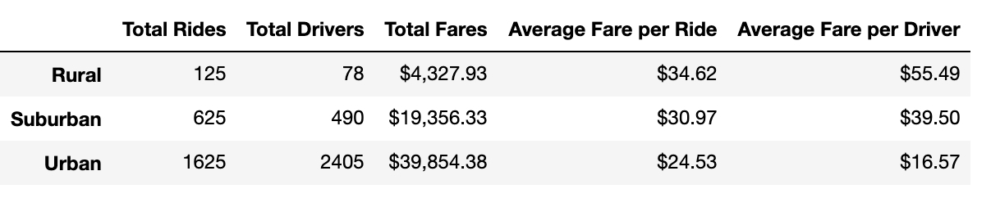
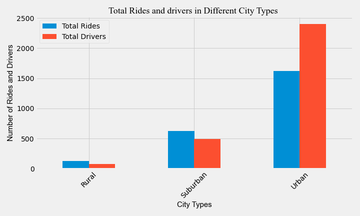
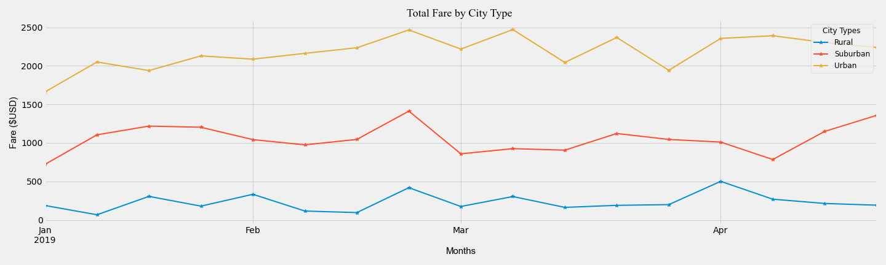

# PyBer_Analysis

Ride sharing App with PyBer.

## Overview of the analysis:

The purpose of this analysis is to analyze all the rideshare data from January to end of April of 2019 and create a compelling visualization to provide an insight for the CEO of the company. Our knowledge of Python and Pandas were used to obtain, clean and filter data. By utilizing various matplotlib visualization skills, graphs were created to obtain better understanding of the data.

### Explain the purpose of the new analysis.

After the initial analysis of ride share data, the code was refactored and some new analysis was done to create a summary Data frame that compares the total number of drivers and total rides in urban, suburban and rural cities. The Summary also gives insight about the Average fare per ride and per driver in these city types. The code was further refactored to filter through the data and get information on the total weekly fares for each city types. Pandas and matplotlib skills were utilized to create a multiline graph that clearly shows the total weekly fares for urban, suburban and rural city types.

## Results:

### Analysis of the summary dataframe.

* Looking at the bar graph it is clearly evident that the number of drivers in the Urban city type is way higher (2405) than the suburban (490) and the rural city types (78).  
* The number of total rides is also very high in the urban city type as compared to the suburban and rural.  
* Interestingly, the average fare per ride is very high in the rural at $34.62/ride as compared to the urban area which is $24.53 per ride.  
* Rural areas have less population density and more open land with few homes or other buildings. The buildings and homes are well spread out in the city. These could be an explanation as to why there are  less drivers and less number of rides and more average fare per ride.  
* The Average fare per driver is $55.49 in the rural city type which is way higher than the suburban ($39.50) and urban ($16.57) city type. Since the number of drivers are less in the rural area the average fare per driver is way higher in the rural area in order to keep up with the maintenance cost price.  

* There is a negative correlation between the total number of rides in a city and the average fare per ride.  

* Since the number of total rides are way higher in the urban city types(1625), so the total fare in urban city($39,854.38) is also higher than the suburban($19,356.33) and rural city type($4,327.93).

The multi line chart plots the total weekly fare of the urban, suburban and rural city types.  
* There was a spike in number of rides and hence the total ride fare increased in all the city types in the week of February 17th to February 24th.  
* There could be a seasonal correlation between the number of rides. With summer approaching there is an increase in the number of rides and hence the total weekly fares. This was clearly visualized in the suburban city types.  
* In the urban city type, there is a spike every alternate week in the total weekly fares as compared to suburban and rural, which are fairly steady.  
* Suburban type has a fare pickup from the second week of April which coincides with the onset of summer.  

## Summary: Based on the results, provide three business recommendations to the CEO for addressing any disparities among the city types

Based on the above analysis we can recommend that:  
* If the CEO wants to profit more from the urban cities further analysis should be made to look into the seasonal correlation and based on that by hiring more drivers in the peak season will have a positive impact on the company.  
* Reducing the fare per ride in the rural cities might attract more riders and in the long run the company can expect to see more profit from the rural cities.  
* An incentive program can attract more riders in all the city types. There will be a huge bloom in the urban cities due to this program whereas the profits from suburban and rural cities might increase aswell because of this program.  
